# Rapport Technique  
## Mise en place d’une Infrastructure à Clés Publiques PKI à Trois Niveaux

**Projet de demi-module : Cryptographie et Blockchain**  
**Master : MMSD**  
**Professeur : LECHHAB OUADRASSI Nihad**  
**Sous supervision de : Mr AZMANI Abdellah**  
**Réalisé par : Acherrat Abdelkhalak**

---

# Table des matières

1. Introduction  
2. Objectifs du projet  
3. Architecture générale de la PKI  
4. Environnement de travail  
5. Création de la Root CA  
6. Création de l’Intermediate CA  
7. Création du certificat serveur  
8. Vérification de la chaîne de confiance  
9. Révocation et génération de la CRL  
10. Interface Web Flask  
11. Améliorations proposées  
12. Sécurisation des clés privées  
13. Tests et résultats  
14. Organisation du projet  
15. Conclusion  
16. Annexes  

---

# 1. Introduction

Une Infrastructure à Clés Publiques, ou Public Key Infrastructure, est un système permettant de sécuriser les communications numériques à l’aide de certificats numériques, de clés publiques et de clés privées. Elle permet d’assurer l’authenticité, l’intégrité, la confidentialité et la confiance entre différentes entités communicantes.

Dans ce projet, nous avons mis en place une PKI à trois niveaux composée d’une Root CA, d’une Intermediate CA et d’un certificat final appelé Leaf Certificate. Cette architecture permet de protéger l’autorité racine en évitant son utilisation directe pour signer les certificats finaux.

Le projet a été réalisé sous Ubuntu avec OpenSSL pour la gestion cryptographique et Flask pour la création d’une interface web simple de gestion et de consultation.

---

# 2. Objectifs du projet

Les objectifs principaux du projet sont :

- Comprendre le fonctionnement d’une infrastructure PKI.
- Mettre en œuvre une architecture à trois niveaux.
- Générer des clés privées RSA.
- Créer des certificats auto-signés et signés par une autorité parente.
- Gérer les demandes de signature CSR.
- Vérifier la validité et la chaîne de confiance des certificats.
- Révoquer un certificat et générer une CRL.
- Développer une interface web Flask.
- Ajouter des outils complémentaires d’audit, de statut et de performance.

---

# 3. Architecture générale de la PKI

L’architecture mise en place est composée de trois niveaux :

```text
Root CA
   |
   v
Intermediate CA
   |
   v
Server Certificate / Leaf Certificate
```

## 3.1 Root CA

La Root CA est l’autorité racine. Elle est auto-signée et représente le point de départ de la chaîne de confiance. Dans ce projet, elle sert uniquement à signer l’Intermediate CA.

## 3.2 Intermediate CA

L’Intermediate CA est signée par la Root CA. Elle protège la Root CA en prenant en charge la signature des certificats finaux.

## 3.3 Leaf Certificate

Le Leaf Certificate est le certificat final utilisé par un serveur, un client ou une application. Dans ce projet, il est généré pour le serveur local :

```text
www.mmsd-pki.local
```

---

# 4. Environnement de travail

Le projet a été réalisé dans l’environnement suivant :

- Système d’exploitation : Ubuntu sous VirtualBox.
- Outil cryptographique : OpenSSL.
- Langage : Python 3.
- Framework Web : Flask.
- Terminal Linux.
- Documentation : Markdown.
- Gestion du projet : Git/GitHub.

Commandes principales d’installation :

```bash
sudo apt update
sudo apt install -y openssl python3-full python3-venv python3-pip tree

python3 -m venv venv
source venv/bin/activate
pip install flask
```

---

# 5. Création de la Root CA

La Root CA constitue le premier niveau de la PKI. Elle a été créée avec une clé RSA 4096 bits protégée par AES-256.

## 5.1 Création de l’arborescence

```bash
mkdir -p root-ca/{certs,crl,newcerts,private}
chmod 700 root-ca/private
touch root-ca/index.txt
echo 1000 > root-ca/serial
echo 1000 > root-ca/crlnumber
```

Cette arborescence permet de stocker les certificats, les clés privées, les listes de révocation et la base de données OpenSSL.

## 5.2 Génération de la clé privée

```bash
openssl genrsa -aes256 -out root-ca/private/root-ca.key.pem 4096
chmod 400 root-ca/private/root-ca.key.pem
```

La permission `400` limite l’accès à la clé privée au propriétaire uniquement.

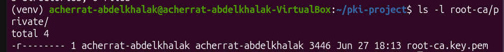

## 5.3 Création du certificat auto-signé

```bash
openssl req -config root-ca/openssl.cnf \
  -key root-ca/private/root-ca.key.pem \
  -new -x509 -days 3650 -sha256 \
  -extensions v3_ca \
  -out root-ca/certs/root-ca.cert.pem
```

Le certificat Root CA est auto-signé et contient l’extension `CA:TRUE`, ce qui confirme son rôle d’autorité de certification.

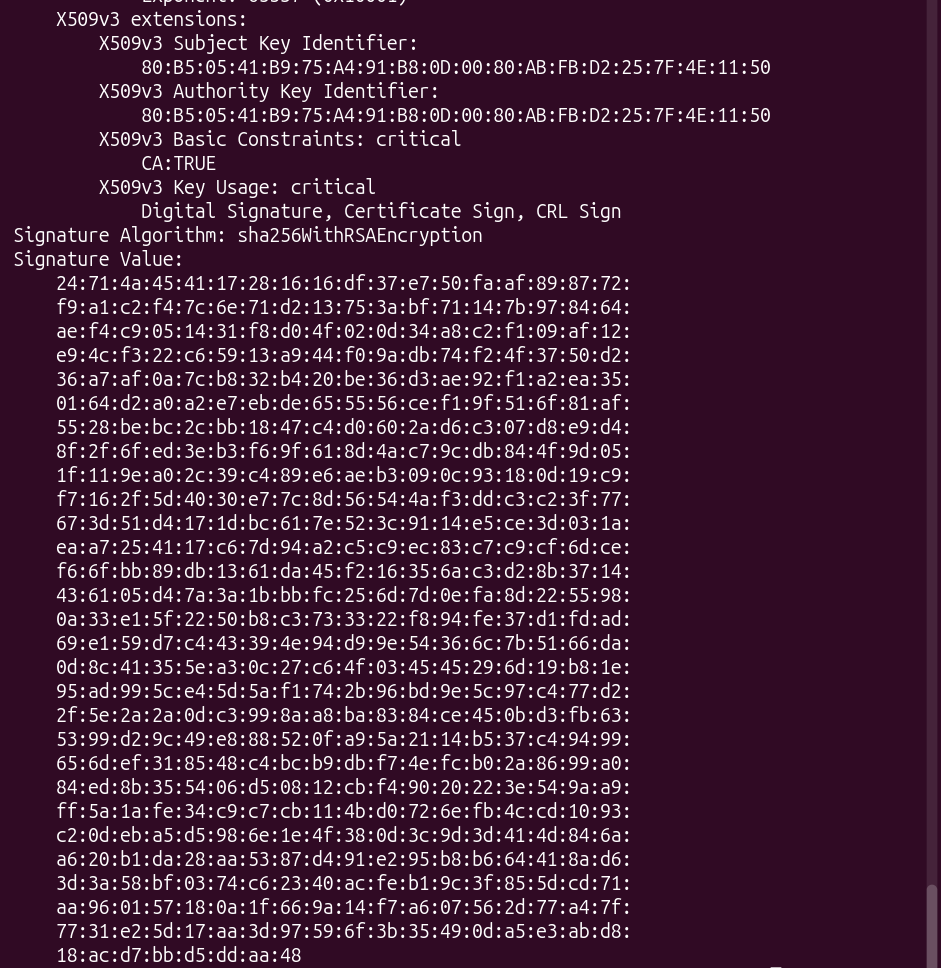

---

# 6. Création de l’Intermediate CA

L’Intermediate CA représente le deuxième niveau de la chaîne de confiance.

## 6.1 Création de l’arborescence

```bash
mkdir -p intermediate-ca/{certs,crl,csr,newcerts,private}
chmod 700 intermediate-ca/private
touch intermediate-ca/index.txt
echo 1000 > intermediate-ca/serial
echo 1000 > intermediate-ca/crlnumber
```

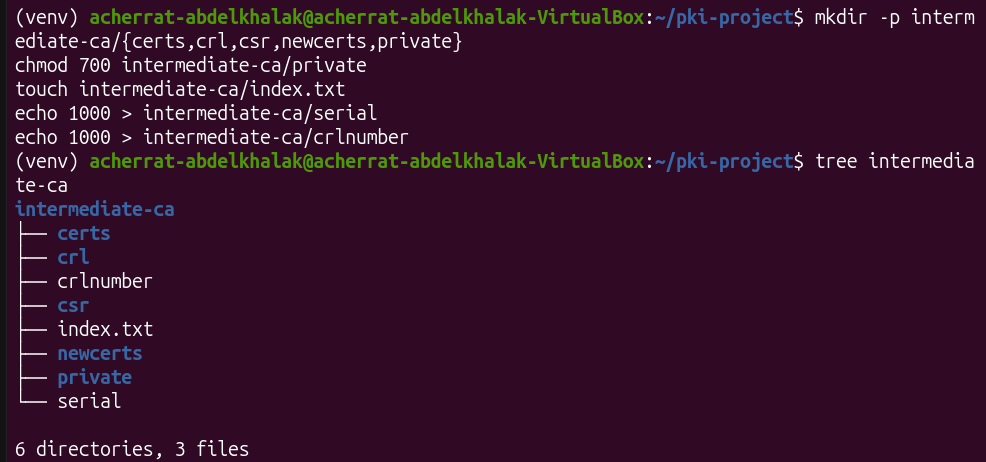

## 6.2 Génération de la clé privée

```bash
openssl genrsa -aes256 -out intermediate-ca/private/intermediate-ca.key.pem 4096
chmod 400 intermediate-ca/private/intermediate-ca.key.pem
```

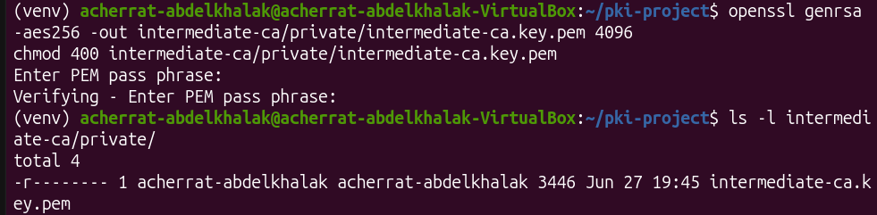

## 6.3 Génération de la CSR

```bash
openssl req -config intermediate-ca/openssl.cnf \
  -new -sha256 \
  -key intermediate-ca/private/intermediate-ca.key.pem \
  -out intermediate-ca/csr/intermediate-ca.csr.pem
```

La CSR contient les informations d’identité de l’Intermediate CA et sera signée par la Root CA.

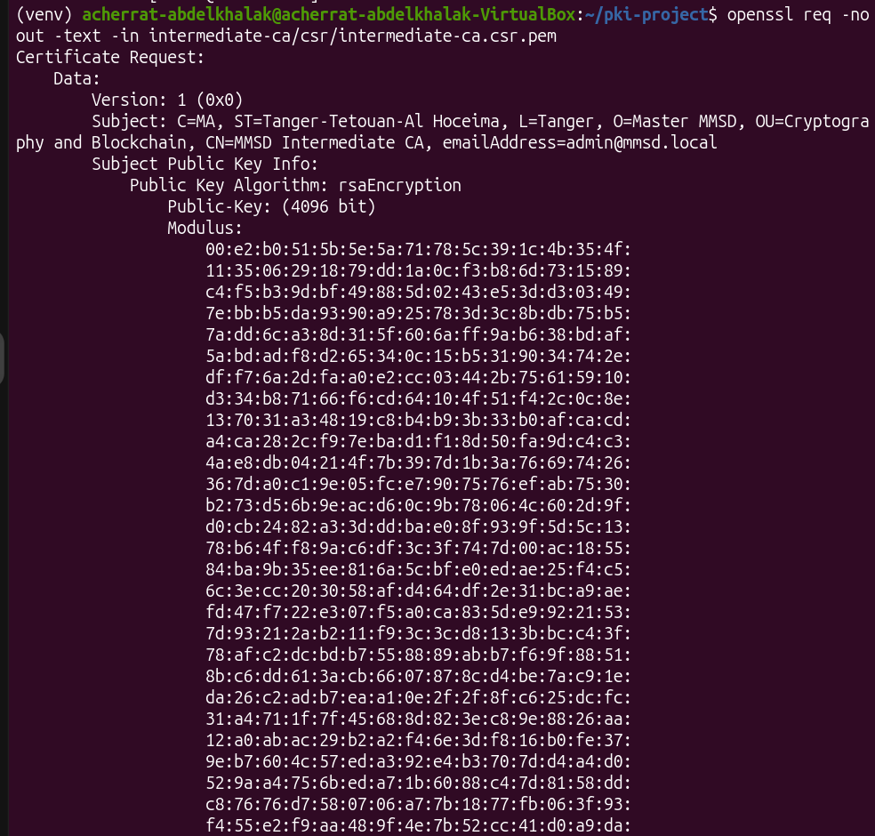

---

# 7. Signature de l’Intermediate CA par la Root CA

La CSR de l’Intermediate CA a été signée par la Root CA avec la commande suivante :

```bash
openssl ca -config root-ca/openssl.cnf \
  -extensions v3_intermediate_ca \
  -days 1825 -notext -md sha256 \
  -in intermediate-ca/csr/intermediate-ca.csr.pem \
  -out intermediate-ca/certs/intermediate-ca.cert.pem
```

Le certificat généré contient l’extension `CA:TRUE` avec la contrainte `pathlen:0`, ce qui signifie que l’Intermediate CA peut signer des certificats finaux sans pouvoir créer une autre autorité intermédiaire.

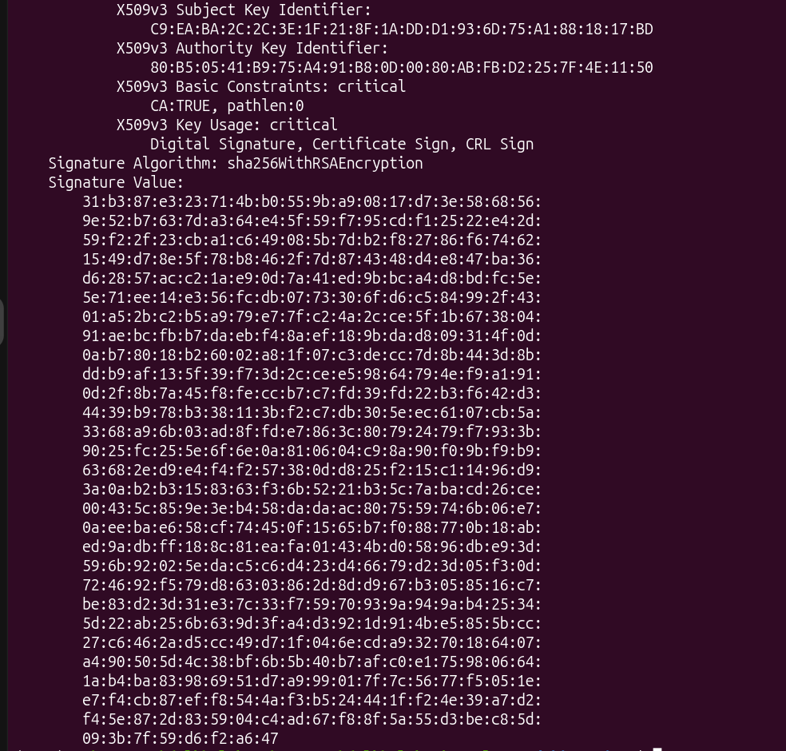

La vérification a été effectuée avec :

```bash
openssl verify -CAfile root-ca/certs/root-ca.cert.pem \
  intermediate-ca/certs/intermediate-ca.cert.pem
```

Résultat attendu :

```text
intermediate-ca/certs/intermediate-ca.cert.pem: OK
```

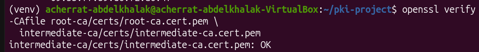

---

# 8. Création du certificat serveur

Le certificat serveur représente le troisième niveau de la PKI.

## 8.1 Génération de la clé privée serveur

```bash
openssl genrsa -out leaf-certificates/server.key.pem 2048
chmod 400 leaf-certificates/server.key.pem
```

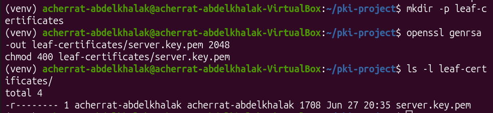

## 8.2 Génération de la CSR serveur

```bash
openssl req -new -sha256 \
  -key leaf-certificates/server.key.pem \
  -out leaf-certificates/server.csr.pem \
  -config leaf-certificates/server.cnf
```

La CSR contient le Common Name `www.mmsd-pki.local` ainsi que l’extension `Subject Alternative Name`.

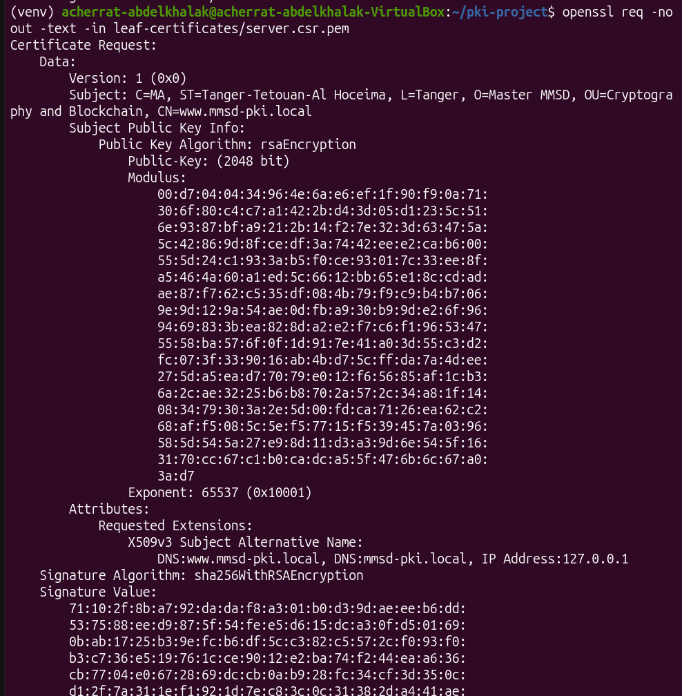

## 8.3 Signature par l’Intermediate CA

```bash
openssl ca -config intermediate-ca/openssl.cnf \
  -extensions server_cert \
  -days 825 -notext -md sha256 \
  -in leaf-certificates/server.csr.pem \
  -out leaf-certificates/server.cert.pem
```

Le certificat serveur contient l’extension `CA:FALSE`, ce qui signifie qu’il s’agit d’un certificat final et non d’une autorité de certification.

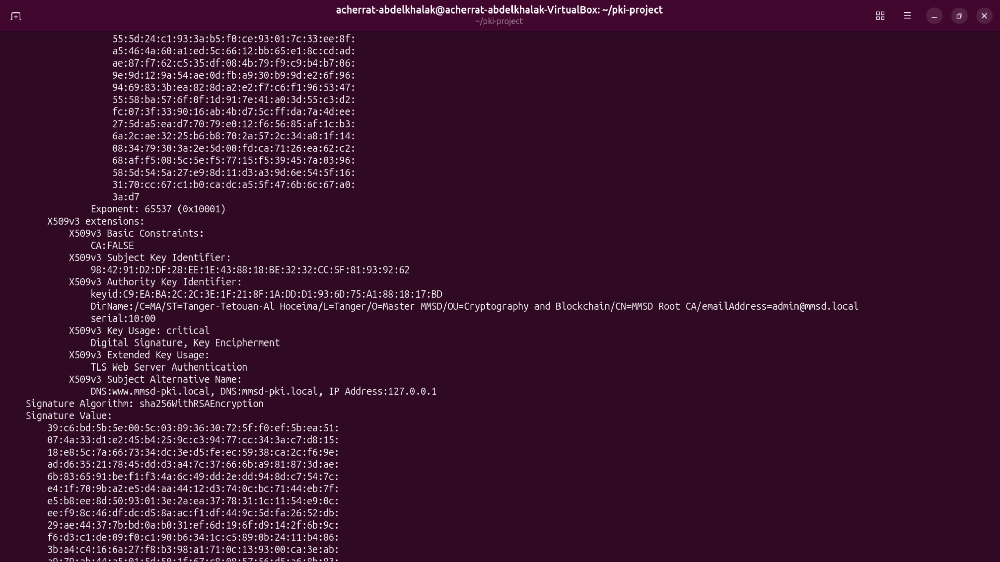

---

# 9. Vérification de la chaîne de confiance

Un fichier de chaîne a été créé en combinant le certificat de l’Intermediate CA avec celui de la Root CA :

```bash
cat intermediate-ca/certs/intermediate-ca.cert.pem \
    root-ca/certs/root-ca.cert.pem \
    > chain/ca-chain.cert.pem
```

La vérification de l’Intermediate CA a été réalisée avec :

```bash
openssl verify -CAfile root-ca/certs/root-ca.cert.pem \
  intermediate-ca/certs/intermediate-ca.cert.pem
```

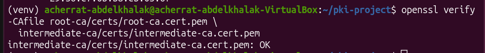

La vérification du certificat serveur a été réalisée avec :

```bash
openssl verify -CAfile chain/ca-chain.cert.pem \
  leaf-certificates/server.cert.pem
```

Résultat attendu :

```text
leaf-certificates/server.cert.pem: OK
```

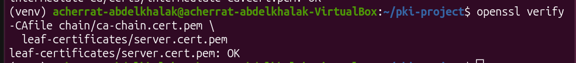

Cette étape confirme que le certificat serveur est correctement rattaché à la chaîne de confiance.

---

# 10. Révocation et génération de la CRL

La révocation permet d’annuler un certificat avant sa date d’expiration.

## 10.1 Révocation du certificat serveur

```bash
openssl ca -config intermediate-ca/openssl.cnf \
  -revoke leaf-certificates/server.cert.pem
```

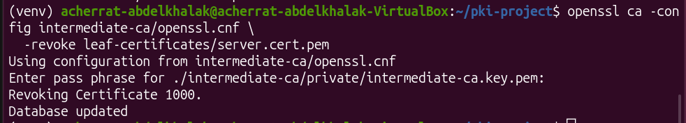

## 10.2 Génération de la CRL

```bash
openssl ca -config intermediate-ca/openssl.cnf \
  -gencrl \
  -out intermediate-ca/crl/intermediate-ca.crl.pem
```

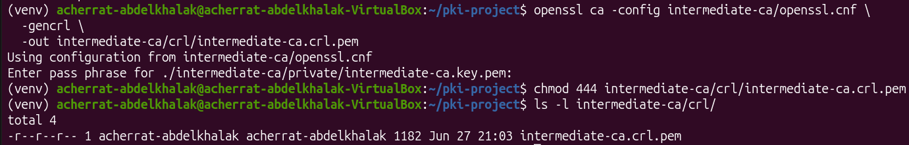

## 10.3 Affichage de la CRL

```bash
openssl crl -in intermediate-ca/crl/intermediate-ca.crl.pem \
  -noout -text
```

La CRL contient la liste des certificats révoqués.

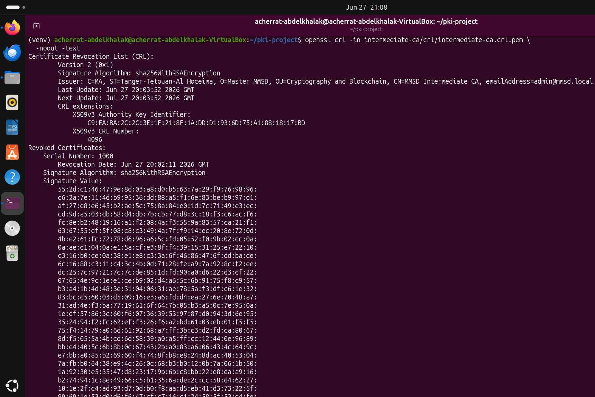

## 10.4 Vérification avec CRL

```bash
openssl verify -crl_check \
  -CAfile chain/ca-chain.cert.pem \
  -CRLfile intermediate-ca/crl/intermediate-ca.crl.pem \
  leaf-certificates/server.cert.pem
```

Résultat attendu après révocation :

```text
certificate revoked
```

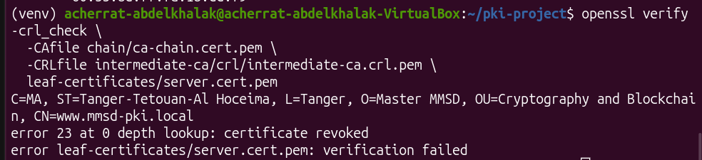

---

# 11. Interface Web Flask

Une interface web simple a été développée avec Flask pour faciliter l’interaction avec la PKI.

Fonctionnalités principales :

- Afficher le certificat Root CA.
- Afficher le certificat Intermediate CA.
- Afficher le certificat serveur.
- Vérifier la chaîne de confiance.
- Afficher la CRL.
- Vérifier le statut de révocation.
- Afficher la base de données de l’Intermediate CA.
- Lancer les tests avancés.

Lancement de l’interface :

```bash
cd ~/pki-project
source venv/bin/activate
cd flask-app
python app.py
```

Adresse locale :

```text
http://127.0.0.1:5000
```

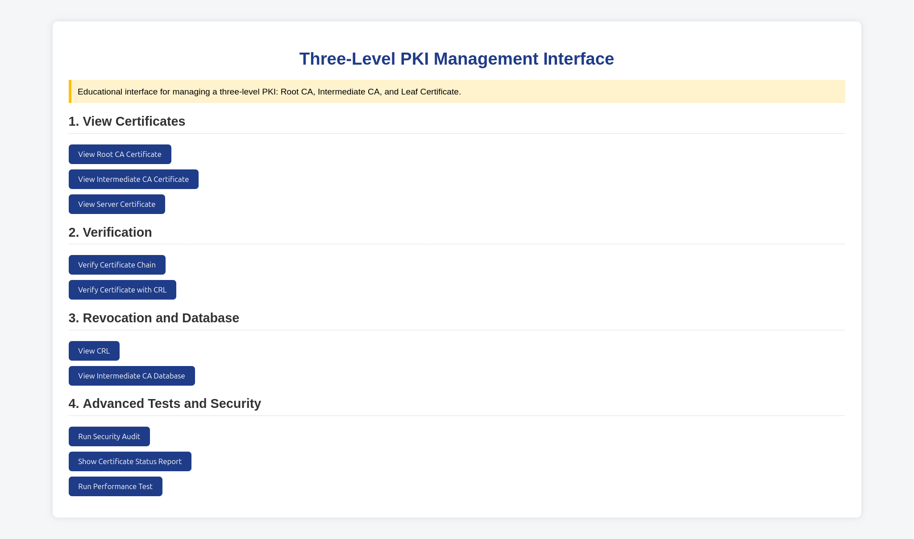

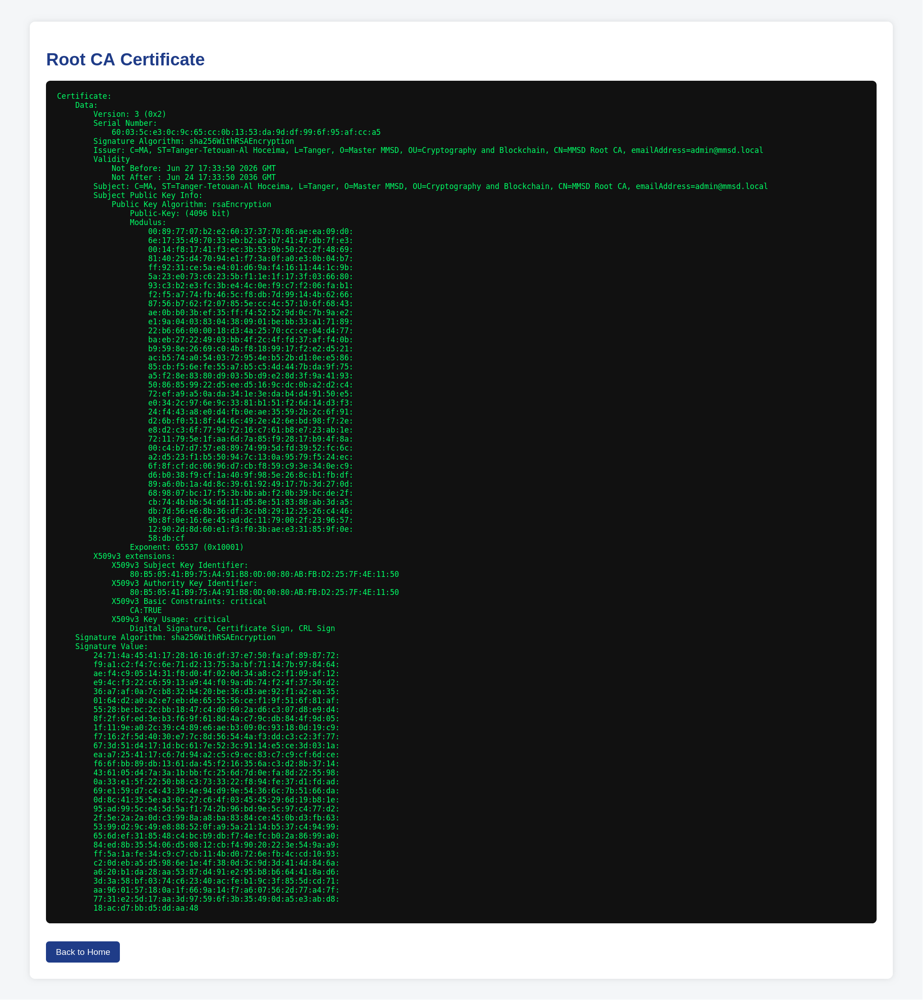

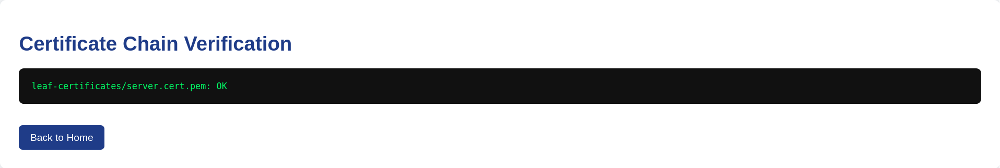

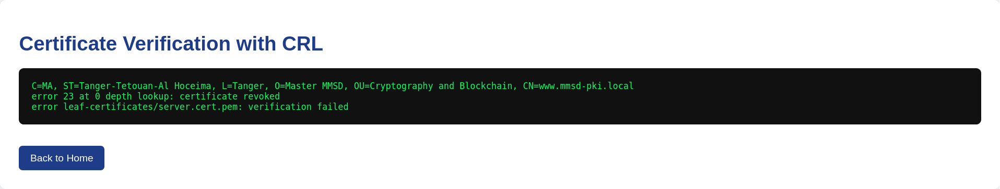

---

# 12. Améliorations proposées

Afin d’améliorer la qualité du projet, plusieurs fonctionnalités supplémentaires ont été ajoutées.

## 12.1 Security Audit

Un script d’audit de sécurité vérifie les permissions des clés privées et des répertoires sensibles :

```bash
./tools/security_audit.sh
```

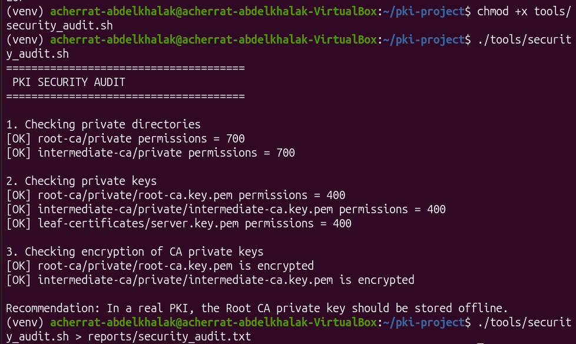

## 12.2 Certificate Status Report

Ce script affiche les informations principales des certificats : sujet, émetteur, numéro de série et dates de validité.

```bash
./tools/cert_status.sh
```

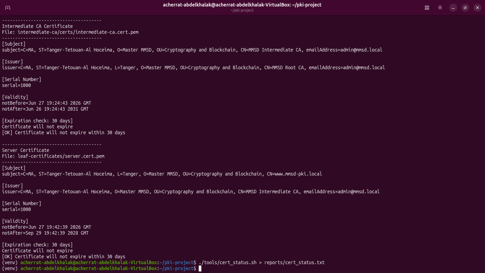

## 12.3 Performance Test

Ce test mesure le temps moyen nécessaire pour vérifier la chaîne de confiance.

```bash
./tools/performance_test.sh 100
```

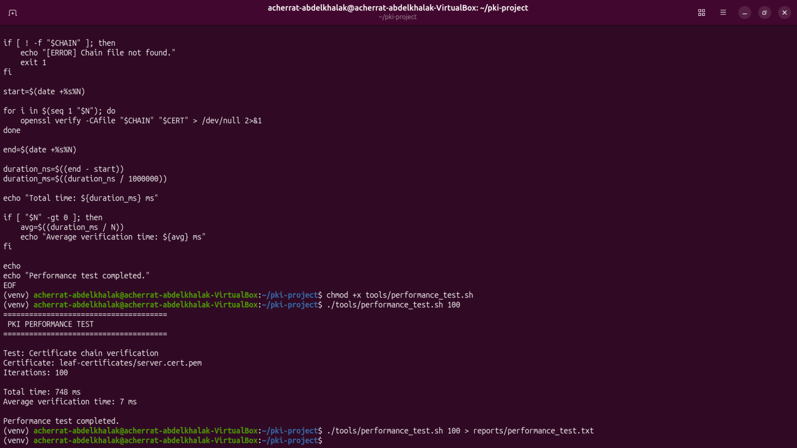

Ces améliorations rendent le projet plus complet et répondent aux recommandations d’ajout de fonctionnalités avancées, de sécurité et de tests.

---

# 13. Sécurisation des clés privées

La sécurité des clés privées est un élément fondamental dans une infrastructure PKI.

Mesures appliquées :

- Clés Root CA et Intermediate CA chiffrées avec AES-256.
- Permissions strictes sur les répertoires `private`.
- Permission `700` pour les dossiers privés.
- Permission `400` pour les clés privées.
- Utilisation limitée de la Root CA.
- Recommandation de conservation hors ligne de la Root CA dans un environnement réel.

---

# 14. Organisation du projet

L’organisation finale du projet est la suivante :

```text
pki-project/
|-- root-ca/
|-- intermediate-ca/
|-- leaf-certificates/
|-- chain/
|-- flask-app/
|-- tools/
|-- reports/
|-- screenshots/
|-- documentation/
|-- commands.md
`-- README.md
```

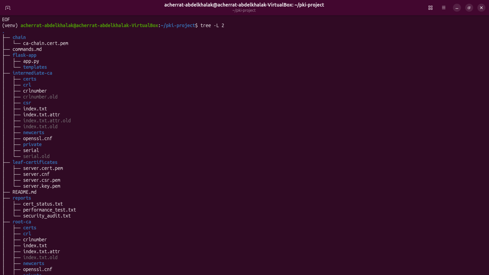

---

# 15. Conclusion

Ce projet a permis de mettre en place une infrastructure PKI complète à trois niveaux. La Root CA a été créée comme autorité racine auto-signée, puis utilisée pour signer l’Intermediate CA. Cette dernière a ensuite signé le certificat serveur final.

Le projet couvre les principales étapes du cycle de vie des certificats : génération de clés, création de CSR, signature, vérification, révocation, génération de CRL et vérification du statut de révocation.

Une interface Flask a également été développée pour faciliter l’interaction avec la PKI. Enfin, des outils complémentaires d’audit de sécurité, de rapport d’état des certificats et de test de performance ont été ajoutés afin d’améliorer la qualité globale du projet.

---

# 16. Annexes

## Annexe 1 : Fichiers de configuration

Les fichiers de configuration utilisés sont :

```text
root-ca/openssl.cnf
intermediate-ca/openssl.cnf
leaf-certificates/server.cnf
```

## Annexe 2 : Commandes utilisées

Les commandes principales sont regroupées dans :

```text
commands.md
```

## Annexe 3 : Interface Web

Le code source de l’interface Flask se trouve dans :

```text
flask-app/
```

## Annexe 4 : Captures d’écran

Les captures d’écran sont regroupées dans :

```text
screenshots/
```

## Annexe 5 : Scripts avancés

Les scripts d’amélioration sont disponibles dans :

```text
tools/
```
